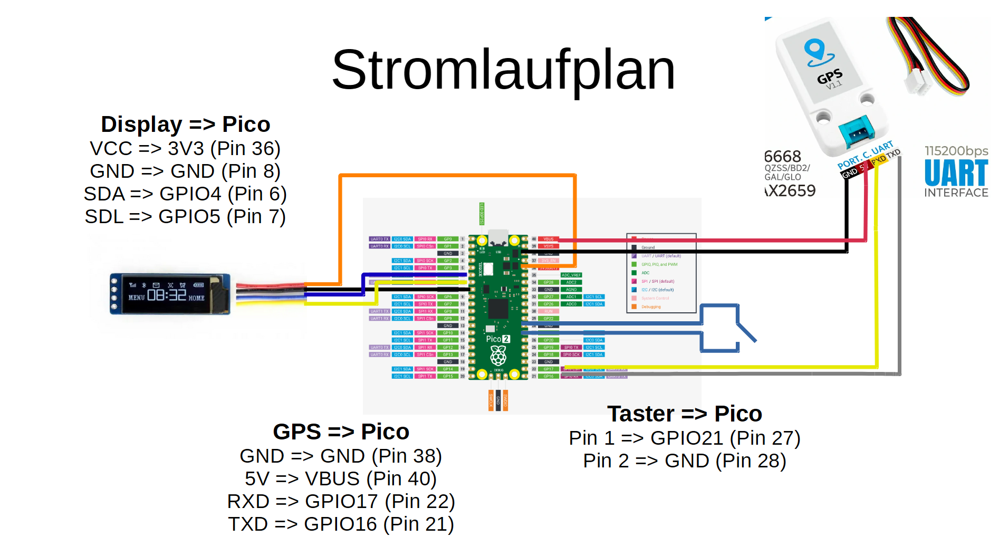
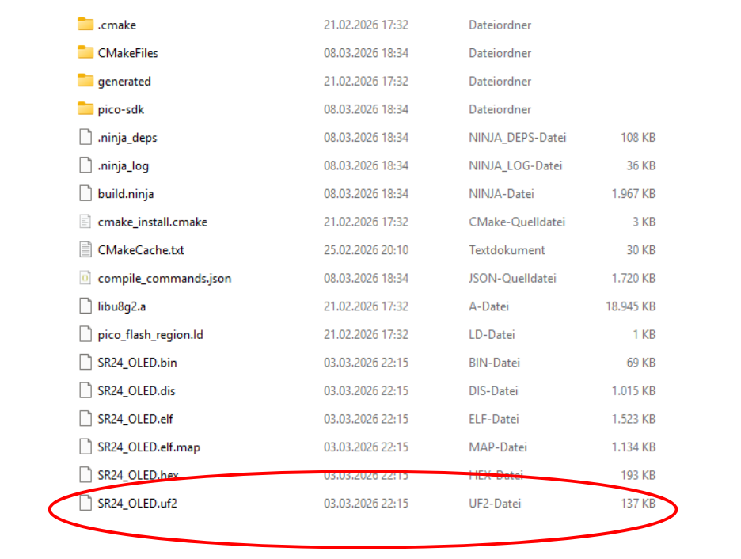

  <h1>SR24 OLED Projekt

Dokumentation für den Anschluss eines Raspberry Pico mit Display am Steuergerät des Umbausatzes SR24 von Second Ride. Wenn der Motor an ist, werden vom Pico sämtliche Daten ausgelesen, die der Controller über USB seriell sendet.

Folgende Daten werden auf dem Display dargestellt:
- Geschwindigkeit
- Akkutemperatur
- Restreichweite

Optional kann ein Taster angeschlossen werden, um weitere Bildschirmausgaben durchschalten zu können

Bildschirm 2
- Balken für die Momentanleistung
- Verbrauch
- Momentanleistung

Bildschirm 3
- Spannung
- Strom

Weiterhin kann optional ein GPS-Modul angeschlossen werden. Folgende zusätlichen Werte werden dann angezeigt:
- Uhrzeit

# Teileliste

- Raspberry Pico 1
- Waveshare 0.91 OLED
- USB OTG Adapter von Micro USB male nach USB female
- optional: Taster
- optional: M5Stack GPS 1.1 (oder ein beliebig anderes GPS- Modul !!!Achtung!!! Baud-Rate ggf. anpassen)

Hier sind beispielhaft die Links zu den Teilen, die ich verbaut habe: 
<a 
href="https://www.berrybase.de/raspberry-pi-pico-rp2040-mikrocontroller-board">Raspberry Pico</a>

<a href="https://www.berrybase.de/0.91-128x32-oled-display-modul-einfarbig-weiss-i2c-interface">Waveshare 0.91 OLED</a>

<a href="https://www.berrybase.de/usb-2.0-hi-speed-adapterkabel-0-20m-a-buchse-micro-b-stecker">USB OTG Adapter</a>

<a href="https://openelab.de/products/m5stack-gps-bds-einheit-v1-1?_pos=4&_psq=gps&_ss=e&_v=1.0">M5Stack GPS Adapter</a>

# Zusammenbau

# Raspberry Pico flashen

Zuerst müsst ihr den Raspberry Pico mit gedrückter BOOTSEL Taste an euren PC anstecken. Der Pico wird als Massenspeichergerät erkannt.
Im Ordner /build findet ihr die Datei: SR24_OLED.uf2 Diese Datei muss einfach nur per drag'n'drop auf den Pico geschoben werden. Sobald die Datei kopiert ist, startet der Pico neu und kann mit dem USB Kabel vom SR24 verbunden werden.

# Bedienung

Kurzes Drücken auf den Taster schaltet die Bildschirme durch. Wird der Taster für mindestens 2 Sekunden gehalten, geht der Pico in den Bootmodus, sodass er wieder als Massenspeichergerät am PC erkannt wird. So kann überarbeitete Software hochgeladen werden, ohne dass man an die BOOTSEL Taste vom Pico muss.

  <h3>Willkommen beim SR24 Dashboard</h3>
  

    Dieser Text wurde mit <strong>HTML-Tags</strong> formatiert. 
    Er ist zentriert und enthält einen <a href="https://www.berrybase.de/raspberry-pi-pico-rp2040-mikrocontroller-board">Link zur u8g2 Bibliothek</a>.
  

